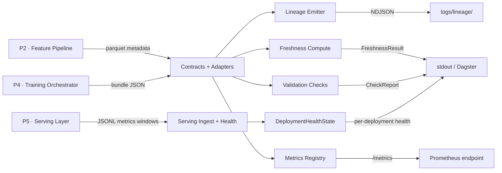

# P6 — Monitoring and Feedback Layer

System-integrated monitoring and feedback layer for the urban mobility ML platform.

## Role in the platform

| Layer | Repo | Role |
|-------|------|------|
| P1 | urban-mobility-control-tower | Real-time data ingestion, CDC, streaming aggregation |
| P2 | mobility-feature-pipeline | Feature engineering pipeline |
| P3 | mobility-feature-store | Feature storage and serving |
| P4 | ml-training-orchestrator | Model training |
| P5 | mobility-serving-layer | Prediction serving |
| **P6** | **monitoring-feedback-layer** | **Monitoring, lineage, freshness, validation** |

P6 observes metadata artifacts emitted by P2–P5 and produces lineage events, freshness assessments, validation reports, and Prometheus metrics. It does not process raw data — it operates on explicit metadata contracts.

## What P6 observes

- **P2 → P6**: Dataset build metadata (name, version, built_at, row/feature counts)
- **P4 → P6**: Training run metadata (run_id, model, input dataset, duration, metrics)
- **P5 → P6**: Serving metrics windows (per-deployment latency, error counts, request volume)



## Upstream / downstream contracts

### Input: Dataset metadata (P2 → P6)

```json
{
  "dataset_name": "bike_demand_pti",
  "dataset_version": "2026-04-07T08:00:00Z",
  "path": "exports/bike_demand_pti/2026-04-07/data.parquet",
  "built_at": "2026-04-07T08:02:10Z",
  "row_count": 1245231,
  "feature_count": 38,
  "target": "target_empty_next_hour",
  "entity": "station_id",
  "event_ts": "obs_ts",
  "schema_version": "v1"
}
```

### Input: Training metadata (P4 → P6)

```json
{
  "run_id": "run_2026_04_07_001",
  "model_name": "bike_demand_model",
  "model_version": "v1",
  "input_dataset_name": "bike_demand_pti",
  "input_dataset_version": "2026-04-07T08:00:00Z",
  "started_at": "2026-04-07T08:10:00Z",
  "completed_at": "2026-04-07T08:12:30Z",
  "metrics": { "rmse": 0.182, "mae": 0.11 },
  "artifact_path": "models/v1/model.pkl"
}
```

### Input: Serving metrics windows (P5 → P6)

```json
{
  "schema_version": "v1",
  "window_start": "2026-04-07T10:00:00Z",
  "window_end": "2026-04-07T10:01:00Z",
  "service_name": "mobility-serving-layer",
  "service_version": "0.1.0",
  "environment": "production",
  "deployment_id": "dep-001",
  "endpoint_name": "/predict",
  "model_name": "bike_demand_model",
  "model_version": "v1",
  "bundle_id": "bundle-abc",
  "input_dataset_name": "bike_demand_pti",
  "input_dataset_version": "2026-04-07T08:00:00Z",
  "request_count": 100,
  "success_count": 98,
  "failure_count": 1,
  "rejected_count": 1,
  "timeout_count": 0,
  "latency_p50_ms": 12.0,
  "latency_p95_ms": 45.0,
  "latency_p99_ms": 120.0,
  "validation_error_count": 0,
  "feature_lookup_error_count": 0,
  "model_load_error_count": 0,
  "inference_runtime_error_count": 0,
  "dependency_error_count": 0,
  "internal_error_count": 0,
  "input_schema_failure_count": 0,
  "missing_required_field_count": 0,
  "invalid_type_count": 0,
  "domain_violation_count": 0,
  "prediction_count": 98,
  "prediction_null_count": 0,
  "prediction_non_finite_count": 0,
  "prediction_out_of_range_count": 0,
  "fallback_prediction_count": 0,
  "heartbeat_emitted_at": "2026-04-07T10:01:00Z"
}
```

P5 emits JSONL files under `artifacts/serving/metrics/{date}/{hour}/`. P6 discovers and ingests all `.jsonl` files, validates each record against the `ServingMetricsWindow` contract, deduplicates on `(deployment_id, endpoint_name, window_start, window_end)`, and feeds the result into health classification.

### Output: Lineage events

NDJSON files under `logs/lineage/` with dataset build and training run completion events. Each event links inputs to outputs with explicit artifact references.

### Output: Prometheus metrics

`/metrics` endpoint exposing:
- `ml_dataset_build_duration_seconds` (histogram)
- `ml_training_duration_seconds` (histogram)
- `ml_prediction_total` (counter)
- `ml_feature_freshness_seconds` (gauge)

### Output: DeploymentHealthState

Per-deployment health classification derived from serving metrics windows:

```json
{
  "deployment_id": "dep-001",
  "model_name": "bike_demand_model",
  "model_version": "v1",
  "bundle_id": "bundle-abc",
  "input_dataset_name": "bike_demand_pti",
  "input_dataset_version": "2026-04-07T08:00:00Z",
  "status": "healthy",
  "evaluated_windows": 5,
  "latest_window_end": "2026-04-07T10:05:00Z",
  "missing_window_count": 0,
  "detail": "all checks passed"
}
```

`status` is one of `healthy`, `degraded`, or `unhealthy`, classified by staleness, gap detection, latency thresholds, and error rates. See `serving/health.py` for threshold logic.

### Output: FreshnessResult

```json
{
  "dataset_name": "bike_demand_pti",
  "dataset_version": "2026-04-07T08:00:00Z",
  "freshness_seconds": 1200.0,
  "status": "FRESH"
}
```

`status` is `FRESH` or `STALE` based on a configurable threshold (default 1800s).

### Output: CheckReport

```json
{
  "metadata_path": "tests/fixtures/dataset_metadata.json",
  "all_passed": true,
  "results": [
    {"check": "file_exists", "passed": true, "detail": ""},
    {"check": "valid_json", "passed": true, "detail": ""},
    {"check": "dataset_name_present", "passed": true, "detail": ""},
    {"check": "dataset_version_present", "passed": true, "detail": ""},
    {"check": "freshness_computable", "passed": true, "detail": ""}
  ]
}
```

## MVP capabilities

1. **Lineage emission** — Parse metadata, emit structured lineage events as local NDJSON
2. **Prometheus metrics** — Expose a `/metrics` endpoint with ML-specific metrics
3. **Feature freshness** — Compute freshness lag from dataset metadata, classify FRESH/STALE
4. **Validation checks** — Verify metadata file structure and required fields

## Repository structure

```
monitoring-feedback-layer/
  src/monitoring/
    __init__.py
    cli.py                    # Typer CLI entrypoint
    config.py                 # Global constants
    contracts/
      dataset.py              # Dataset metadata pydantic model
      training.py             # Training metadata pydantic model
      serving.py              # Serving metrics window contract (P5 → P6)
      adapters.py             # P2/P4 real artifact → P6 contract adapters
    lineage/
      schemas.py              # Lineage event pydantic models
      emitter.py              # Event builder + NDJSON persistence
    metrics/
      registry.py             # Prometheus metric definitions + helpers
      server.py               # HTTP metrics server
    freshness/
      compute.py              # Freshness computation
    validation/
      checks.py               # Metadata validation checks
    serving/
      ingest.py               # P5 JSONL discovery + ingestion
      health.py               # Per-deployment health classification
    dagster/
      assets.py               # P2/P4 monitoring assets
      serving_assets.py       # P5 serving health assets
      jobs.py                 # Scheduled monitoring job
      schedules.py            # Cron schedule
      defs.py                 # Dagster definitions entrypoint
  tests/
    fixtures/                 # Sample metadata JSON files + P4 bundle
    test_adapters.py
    test_cli_metrics.py
    test_contracts.py
    test_dagster_defs.py
    test_freshness.py
    test_lineage.py
    test_metrics.py
    test_serving.py
    test_validation.py
  pyproject.toml
  README.md
```

## CLI usage

```bash
# Emit lineage for a dataset build
monitoring emit-lineage-dataset-build --metadata-path tests/fixtures/dataset_metadata.json

# Emit lineage for a training run
monitoring emit-lineage-training-run --metadata-path tests/fixtures/training_metadata.json

# Compute feature freshness
monitoring compute-freshness --metadata-path tests/fixtures/dataset_metadata.json

# Run validation checks
monitoring run-checks --metadata-path tests/fixtures/dataset_metadata.json

# Serve Prometheus metrics (empty registry)
monitoring serve-metrics --port 8000

# Serve metrics with sample data pre-populated
monitoring demo-metrics --port 8000

# Simulate prediction events
monitoring simulate-prediction --count 10 --model-name bike_demand_model
```

## Running locally

```bash
# Install with uv
uv sync --extra dev

# Run tests
uv run pytest -v

# Or run directly
uv run monitoring --help
```

## Running metrics locally

`serve-metrics` starts an empty registry.  Since all metrics use labels,
`prometheus_client` won't emit `ml_*` lines until at least one observation
is recorded in the same process.  Use `demo-metrics` to populate sample
values and start the server in one step:

```bash
# Start server with sample metrics pre-populated
uv run monitoring demo-metrics --port 8000

# In another terminal
curl -s http://localhost:8000/metrics | grep ^ml_
```

This limitation goes away once a persistent metric store (Prometheus scraper
or pushgateway) replaces the in-process HTTP server.

## Trade-offs

| Decision | Upside | Downside |
|----------|--------|----------|
| Local NDJSON lineage | No infra, simple append-only format | No query/search, no lineage graph |
| prometheus_client HTTP server | Zero-dependency metrics endpoint | Single process, no persistence across restarts |
| Pydantic strict contracts | Early detection of upstream drift | Schema must be updated when contracts change |
| No external backends | Easy local development | Not production-ready without extension |

## Current validation status

| Layer | Status | Detail |
|-------|--------|--------|
| **P2** | Validated against real artifact | Adapter tested against `mobility-feature-pipeline/output/training_dataset_20260403_230612.parquet`. Lineage emission, freshness computation, and validation checks all ran successfully. |
| **P4** | Adapter tested against expected format | Adapter tested against a fixture built from P4's `bundle.py` code, matching the exact JSON schema it produces. Full validation requires a real training run to produce `artifacts/<run_id>/`. |
| **P5** | Contract integrated, health derivation operational | `ServingMetricsWindow` JSONL ingestion with per-deployment health state classification. P5 emits structured serving artifacts consumed by P6. |

## P2 contract mapping (real artifact)

**Artifact**: `mobility-feature-pipeline/output/training_dataset_20260403_230612.parquet`

P2 does not emit a standalone JSON file. It embeds metadata in the Parquet
schema. The adapter `contracts/adapters.py:adapt_p2_parquet` reads this
metadata and constructs the P6 `DatasetMetadata` contract.

| P6 field | P2 actual source | Mapping |
|----------|-----------------|---------|
| `dataset_name` | Parquet filename stem | Derived |
| `dataset_version` | `build_timestamp` (YYYYMMDD_HHMMSS) | Parsed to ISO-8601 |
| `path` | Parquet file path | Direct |
| `built_at` | `build_timestamp` | Parsed to datetime |
| `row_count` | Parquet schema metadata `row_count` | Direct (string to int) |
| `feature_count` | Column count minus non-feature cols | Derived (22 features) |
| `target` | Known: `target_empty_next_hour` | Hardcoded |
| `entity` | Known: `station_id` | Hardcoded |
| `event_ts` | Known: `obs_ts` | Hardcoded |

Requires `pyarrow` at runtime.

## P4 contract mapping (expected format, not yet validated against real artifact)

P4's `build_inference_bundle()` in `artifacts/bundle.py` will produce a
directory with `metadata.json`, `metrics.json`, and `model_uri.txt`. No
such directory has been produced yet.

The adapter `contracts/adapters.py:adapt_p4_bundle` maps the expected
structure to the P6 `TrainingMetadata` contract:

| P6 field | P4 expected source | Mapping |
|----------|-------------------|---------|
| `run_id` | `metadata.json -> run_id` | Direct |
| `model_name` | `metadata.json -> candidate_name` | Renamed |
| `model_version` | `metadata.json -> model_version` | Direct (falls back to `"unknown"` for older bundles) |
| `started_at` | `metadata.json -> created_at` | Direct (no separate start time) |
| `completed_at` | `metadata.json -> created_at` | Same as started_at (duration=0) |
| `metrics.rmse` | `metrics.json -> test_rmse` | Renamed |
| `metrics.mae` | `metrics.json -> test_mae` | Renamed |
| `artifact_path` | `model_uri.txt` content | Direct |
| `input_dataset_name` | Not emitted by P4 | Set to "unknown" |
| `input_dataset_version` | Not emitted by P4 | Set to "unknown" |

### Validating P4 once a real artifact exists

After running a real training pipeline in P4, the bundle directory will
appear at `ml-training-orchestrator/artifacts/<run_id>/`. To validate:

```bash
# Adapt the real P4 bundle to P6 contract format
uv run python -c "
from monitoring.contracts.adapters import adapt_p4_bundle
from monitoring.lineage.emitter import build_training_lineage_event, persist_event
from pathlib import Path

meta = adapt_p4_bundle(Path('/path/to/ml-training-orchestrator/artifacts/<run_id>'))
print(meta.model_dump_json(indent=2))

event = build_training_lineage_event(meta)
log_file = persist_event(event)
print(f'Lineage written to {log_file}')
print(event.model_dump_json(indent=2))
"
```

## Upstream alignment opportunities

P6 already consumes current upstream artifacts through adapters. The following
upstream metadata additions would improve lineage fidelity and reduce
fallback/default handling in the adapters. None are blockers.

**P4 — improved lineage linkage:**
- `input_dataset_name` in `metadata.json` — eliminates `"unknown"` fallback
- `input_dataset_version` in `metadata.json` — enables dataset↔model tracing
- `started_at` timestamp in `metadata.json` — enables real training duration
- `completed_at` timestamp in `metadata.json` — enables real training duration

**P2 — simplified ingestion:**
- Standalone `dataset_metadata.json` alongside the parquet file — removes pyarrow dependency for metadata reads

## Phase 2 — Dagster runtime

Dagster is the intended orchestration and scheduling layer for P6. It replaces
the earlier GitHub Actions scheduled workflow as the runtime direction. The
existing CLI commands remain the execution surface — Dagster assets call the
underlying Python functions directly rather than shelling out.

Dagster definitions live in `src/monitoring/dagster/` and can be loaded with:

```bash
DAGSTER_HOME=/tmp/dagster_home dagster dev -m monitoring.dagster.defs
```

GitHub Actions will be reserved for CI/CD (linting, tests) only.

## Future extensions

- **OpenLineage backend** — Replace local NDJSON with OpenLineage-compatible emission to Marquez or similar
- **Prometheus + Grafana integration** — Scrape from the metrics endpoint, build dashboards
- **P5 dashboards / alerting** — Build dashboards and alerts on top of serving health state
- **Retraining triggers** — When freshness exceeds a threshold, trigger P4 retraining via webhook or message
- **Drift checks** — Statistical drift detection between training and serving distributions
